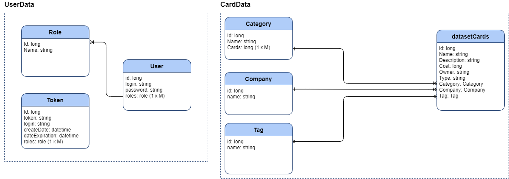

# MORE.tech 3.0 - Тополиный пух
  
**Маркетплейс данных для датасаентистов.**  
Продукт представляет собой веб пространство для обмена, обработки и анализа данных между партнерами. Доступ к данным оформлен в виде ролевой модели, где каждой роли соответствует заранее определенный набор прав. Обмен производится посредством взаимодействия приложения с Data Hub (в прогрессе). 

## Участники
 **Фирсаков Тимур** - product manager, telegram: @timurfirsakov 
  
 **Марашли Илья** - UI/UX, Analitics, telegram: @thebluekit  
  
 **Майоров Женя** - Backend dev, telegram: @airem  
  
 **Рыженкова Настя** - Analytics, Data Science, telegram: @avryzhenkova  
  
 **Сафина Алия** - Frontend dev, telegram: @alutery  

  
## Стек технологий
**Backend**
* Spring Boot 
* Hibernate 
* Postgres 
* Docker  

**Frontend**  
* React.js
* Redux
* Material-UI

## Описание данных

В качестве ключевых сущностей в проекте можно выделить следующие элементы: **Пользователи** и **Данные**. Для предоставления пользователю определенного набора прав выделяются **Роли**, которые могут быть описаны, в виде отдельной сущности. По умолчанию были выделены следующие роли: 
* Администратор;
* Партнер; 
* Менеджер;
* Дата саентист;
* Обозреватель (обычный пользователь).

### Описание ролей
На схеме выделены основные пользовательские роли и их возможности.  


### Построение базы данных
Для реализации также используется база данных PostgreSql, ниже приведены сущности, выделенные в приложении. 


Были выделены две группы таблиц: пользовательские данные и "дата-карты". 
**Пользовательские данные**:  
* Пользователь (user): идентификатор, логин, пароль, а также роль (доступ);
* Роль (role): идентификатор и имя роли, посредством ролей выдаются доступы пользователям;
* Токен:(tocken) валидационный токен, для авторизации пользователя. 

**Дата-карты**: 
* Категория (Category): 
* Компания(Company): 
* Тэг(Tag): 
* Карточка данных(DarasetCard):

## Взаимодействие компонентов 


## REST API 

### Авторизация

1. **POST** /api/login -  
**Входные параметры:**  
```yaml
Request body:
{
  login	: string,
  password : string
}
```
2. **GET** /api/login/token -  
**Входные параметры:**  
```yaml
Request parameters: 
TokenRequest{
  login : string,
  days : int,
  roles : [
     string
  ]
}
```
3. **POST** /api/login/token -  
**Входные параметры:**  
```yaml
Request body: 
{
  token: string
}
```
4. **DELETE** /api/login/token -  
**Входные параметры:**  
```yaml
RequestBody:
{
  login: string
}
```

### Управление датасетами 
1. **GET** /api/dataset/card -  получить информацию по всем карточкам.
**Входные параметры:**
```yaml
Request parameter: 
filter{
  tariffs: [
    string
  ],
  companies: [
    string
  ],
  tags: [
    string
  ]
}
```
**Выходные параметры:**  
```yaml
[
  {
    id: int,
    name: string,
    description: string,
    cost: int,
    owner: string,
    type: string,
    company: string,
    category: string,
    tags: [
      string
    ]
  }
]
```
2. **GET** /api/dataset/card/{id} -  информация по конкретной карточке
**Входные параметры:**
```yaml
id : int
```
**Выходные параметры:**  
```yaml
{
  id: 0,
  name: string,
  description: string,
  cost: 0,
  owner: string,
  type: string,
  company: string,
  category: string,
  tags: [
    string
  ]
}
```
3. **GET** /api/dataset/card/preview - превью карточки с датасетом  
**Входные параметры:**
```yaml
Request parameter: 
filter{
  tariffs: [
    string
  ],
  companies: [
    string
  ],
  tags: [
    string
  ]
}
```
**Выходные параметры:**  
```yaml
[
  {
    category: string,
    cards: [
      {
        id: 0,
        name: string,
        description: string,
        company: string,
        tags: [
          string
        ]
      }
    ]
  }
]
```
4. **GET** /api/dataset/card/by-category -  
**Входные параметры:**  
```yaml
Request parameters: 
CategoryFilter{
  category: string
}

filter{
  tariffs: [
    string
  ],
  companies: [
    string
  ],
  tags: [
    string
  ]
}
```
**Выходные параметры:**  
```yaml
[
  {
    id: 0,
    name: string,
    description: string,
    company: string,
    tags: [
      string
    ]
  }
]
```

## Структура разрабатываемого ПО 


## Фичи
* Токенизация
* Теги  
* Режим ограничения просмотра к датасетам для партнера 
* Персональные рекомендации по постоянным полям 

